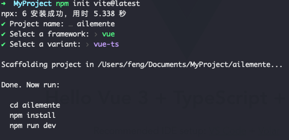

### 环境搭建

#### 1. 创建 vite 项目

`npm init vite@latest`



#### 2. 规范化: husky

husky 会在代码提交前进行代码质量检测。

```
npm install -D husky # 安装husky
npx husky install # 初始化husky
npx husky add .husky/commit-msg "node scripts/verifyCommit.js" # 新增commit-msg钩子，执行 git commit 的时候执行 node scripts/verifyCommit命令来校验commit信息格式
```

项目根目录下新建 `scripts/verifyCommit.js`文件

#### 3. 布局组件

1. 统一样式 `src/styles/*`

2. 注册自定义容器组件

`<el-container></el-container>`

- `src/component/container` 新建 `Container.vue` 编辑
- `src/component/container/index.ts` install 方法
- `src/main.ts` 注册 `ElContainer`

### TDD

#### 1. 安装

引入 Jest

```

npm install -D jest@26 vue-jest@next @vue/test-utils@next
npm install -D babel-jest@26 @babel/core @babel/preset-env
npm install -D ts-jest@26 @babel/preset-typescript @types/jest
```

#### 2. 配置

1. 根目录下新建 `.babel.config.js`，为了使 babel 解析到 node 和 Typescript 环境下。

```
module.exports = {
  presets: [
    ['@babel/preset-env', { targets: { node: 'current' }}],
    '@babel/preset-typescript',
  ],
}
```

2. 根目录下新建 `jest.config.js`，配置 jest 的测试行为 (jest 只执行 .spec.js 结尾的文件)

```
module.exports = {
  transform: {
    '^.+\\.vue$': 'vue-jest', // .vue文件用 vue-jest 处理
    '^.+\\.jsx?$': 'babel-jest', // .js或者.jsx用 babel-jest处理
    '^.+\\.ts$': 'ts-jest' // .ts文件用ts-jest处理
  },
  testMatch: ['**/?(*.)+(spec).[jt]s?(x)']
}
```

3. 配置 package.json，执行 scrips 脚本

`"test": "jest"`

4. TDD 开发组件

使用 Vue 官方推荐库: [@vue/test-utils](https://next.vue-test-utils.vuejs.org/)

- 安装 @vue/test-utils
- `src/components/button` 新建 `Button.spec.ts`
- 写测试案例

  ```

  ```

### 表单组件

#### 1. `form/Form.vue`

- 表单组件的容器：管理每个 `el-form-item` 组件的校验方法
- 提供一个方法：检测所有输入项的 validate 方法

#### 2. `form/FormItem.vue`

`el-form`内部如何管理 `el-form-item`组件？
当 `el-form-item`组件加载完成后需要通知 `el-form`。

`el-form-item`包括的功能有：

- 管理内部的 input 输入标签
- 从 form 组件中获得配置的 rules，通过 rules 的逻辑，判断用户的输入值是否合法。
- 管理当前输入框的 label，看输入状态是否报错，及显示报错信息

### 3. `form/Input.vue`

- 实现 `v-model`
- 输入的校验是在`el-form-item`中完成的

#### 3. 如何通信？

- 父子组件： props 和 emits；子元素通过 `defineDepse` 方法暴露给父元素，父元素可以调用这个方法
- form 和 input 通信（祖先元素和后代元素）: `provide` 和 `inject`(provide 只提供普通的数据，如果子组件内部需要响应式的数据，在 provide 函数内部使用 ref 或 reactive 包裹)
